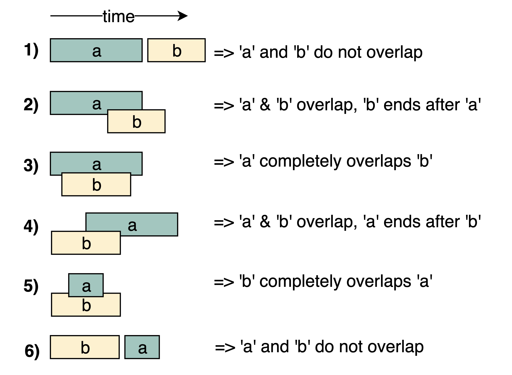

# Data Structure & Algorithm Patterns & Problems

>
> ## **[Common Patterns](https://www.educative.io/courses/grokking-the-coding-interview) - 115**
> 1. [Sliding Window](https://www.educative.io/courses/grokking-the-coding-interview/7D5NNZWQ8Wr) (11)
> 2. [Two Pointers](https://www.educative.io/courses/grokking-the-coding-interview/xlK78P3Xl7E) (11)
> 3. [Fast & Slow pointers](https://www.educative.io/courses/grokking-the-coding-interview/g76PJVmL5PZ) (7)
> 4. [Merge Intervals](https://www.educative.io/courses/grokking-the-coding-interview/3YVYvogqXpA) (7)
> 5. [Cyclic Sort](https://www.educative.io/courses/grokking-the-coding-interview/YVjXo6J9xN9) (8)
> 6. [In-place Reversal of a LinkedList](https://www.educative.io/courses/grokking-the-coding-interview/JE8vzXroA5P) (5)
> 7. [Tree - Breadth First Search](https://www.educative.io/courses/grokking-the-coding-interview/qARvkz138r3) (9)
> 8. [Tree - Depth First Search](https://www.educative.io/courses/grokking-the-coding-interview/q2GxL8GWB6y) (7)
> 9. [Two Heaps](https://www.educative.io/courses/grokking-the-coding-interview/xlm8k0ZND93) (4)
> 10. [Subsets](https://www.educative.io/courses/grokking-the-coding-interview/R87WmWYrELz) (9)
> 11. [Modified Binary Search](https://www.educative.io/courses/grokking-the-coding-interview/JQJOO357VDo) (10)
> 12. [Top 'K' Elements](https://www.educative.io/courses/grokking-the-coding-interview/7XBApZGoEvj) (14)
> 13. [K-way merge](https://www.educative.io/courses/grokking-the-coding-interview/xlGGNlQr8jE) (5)
> 14. [Topological Sort](https://www.educative.io/courses/grokking-the-coding-interview/myNkP2AQw19) (7)
> 15. [Connected components](https://leetcode.com/problems/critical-connections-in-a-network/discuss/453797/Simple-Java-Solution-using-DFS-(Tarjan's-Algo)-%3A-Efficiency-Time-20-and-Space-100) (1)
>
> ## **[Dynamic Programming](https://www.educative.io/courses/grokking-dynamic-programming-patterns-for-coding-interviews) - 35**
> 1. [0/1 Knapsack](https://www.educative.io/courses/grokking-dynamic-programming-patterns-for-coding-interviews/RM1BDv71V60) (6)
> 2. [Unbounded Knapsack](https://www.educative.io/courses/grokking-dynamic-programming-patterns-for-coding-interviews/qV6RXWME4D3) (5)
> 3. [Fibonacci Numbers](https://www.educative.io/courses/grokking-dynamic-programming-patterns-for-coding-interviews/gx6jmzrMwgZ) (6)
> 4. [Palindromic Subsequence](https://www.educative.io/courses/grokking-dynamic-programming-patterns-for-coding-interviews/RMk1D1DY1PL) (5)
> 5. [Longest Common Substring](https://www.educative.io/courses/grokking-dynamic-programming-patterns-for-coding-interviews/RMkk7NwE44R) (13)
>
> ## **[Algorithms](https://www.educative.io/courses/algorithms-coding-interviews-java) - 46**
> 1. [Sorting & Searching](https://www.educative.io/courses/algorithms-coding-interviews-java/B62q79Pn2AJ) (5)
> 2. [Greedy Algorithms](https://www.educative.io/courses/algorithms-coding-interviews-java/3j1R50KnNjQ) (9)
> 3. [Divide & Conquer](https://www.educative.io/courses/algorithms-coding-interviews-java/YQVkrJGZw0p) (11)
> 4. [Graph Algorithms](https://www.educative.io/courses/algorithms-coding-interviews-java/xVVXPWoRjn3) (3)
> 5. [Substring search - KMP](https://leetcode.com/list?selectedList=xi6wvsqe) (4)
> 6. [Substring search - Rabin Karp](https://leetcode.com/list?selectedList=xi6fk8g2) (4)
> 7. [Recursion & Backtracking](https://leetcode.com/list?selectedList=xixq7rvd) (15)
>
> ## **Additional Patterns - 15**
> 1. [Trie](https://leetcode.com/tag/trie/) (5)
> 2. [Union Find](https://leetcode.com/tag/union-find/) (3)
> 3. [Bitwise XOR](https://www.educative.io/courses/grokking-the-coding-interview/RLPGq6Vx0YY) (4)
>

 

# [Common Patterns](https://www.educative.io/courses/grokking-the-coding-interview)

## 1. Sliding Window

### Types

- Fixed Length window
    - Max Sum/Avg Subarray of Size K (643)
- Dynamic Length window
    - Smallest subarray of sum >= to some value S (209)
    - Fruits into basket (904)
    - Maximum Consecutive Ones (1004)
- Dynamic Length window with Additional Data structure
    - Longest Substring length with no more than K distinct characters (340)
    - Longest Substring Without Repeating Characters (3)
    - Longest repeating Character Replacement (424)
- String permutation
    - Find All Anagrams in a String (438)
    - Find if a string contains any Permutation of a pattern (567)
    - Smallest Window substring (76)
    - Word concatenation (30)

### How to identify them ?

- Things we iterate over sequentially
    - _**Contiguous sequence**_ of elements
    - Strings, arrays, linked lists
- Looking for **_some sub-range_** like **Min**, **Max**, **Longest**, **Shortest**, Contained
    - Maybe we need to calculate something

### Common problems

#### 1. [LC-Easy: 643. Maximum Average Subarray](https://leetcode.com/problems/maximum-average-subarray-i/)

If you observe closely, you will realize that to calculate the sum of a contiguous subarray we can utilize the sum of
the previous subarray. For this, consider each subarray as a Sliding Window of size `'k'`. To calculate the sum of the
next subarray, we need to slide the window ahead by one element. So to slide the window forward and calculate the sum of
the new position of the sliding window, we need to do two things:

- Subtract the element going out of the sliding window i.e., subtract the first element of the window.
- Add the new element getting included in the sliding window i.e., the element coming right after the end of the window.

[Solution](https://leetcode.com/problems/maximum-average-subarray-i/discuss/973703/Kotlin-%3A-Sliding-Window-O(N)-Solution)

#### 2. [LC-Medium: 209. Minimum Size Subarray Sum](https://leetcode.com/problems/minimum-size-subarray-sum/)

- First, we will add-up elements from the beginning of the array until their sum becomes greater than or equal to `'S'`.
- These elements will constitute our sliding window. We are asked to find the smallest such window having a sum greater
  than or equal to `'S'`. We will remember the length of this window as the smallest window so far.
- After this, we will keep adding one element in the sliding window (i.e. slide the window ahead), in a stepwise
  fashion.
- In each step, we will also try to shrink the window from the beginning. We will shrink the window until the window's
  sum is smaller than `'S'` again. This is needed as we intend to find the smallest window. This shrinking will also
  happen in multiple steps; in each step we will do two things:
    - Check if the current window length is the smallest so far, and if so, remember its length.
    - Subtract the first element of the window from the running sum to shrink the sliding window.

[Solution](https://leetcode.com/problems/minimum-size-subarray-sum/discuss/973706/Kotlin%3A-Sliding-Window)

#### 3. [LC-Hard: 340. Longest Substring with _At Most K Distinct Characters](https://leetcode.com/problems/longest-substring-with-at-most-k-distinct-characters/)

- Insert characters from the beginning of the string until we have `'K'` distinct characters in a HashMap.
- These characters will constitute our sliding window. We are asked to find the longest such window having no more
  than `'K'` distinct characters. We will remember the length of this window as the longest window so far.
- After this, we will keep adding one character in the sliding window (i.e. slide the window ahead), in a stepwise
  fashion.
- In each step, we will try to shrink the window from the beginning if the count of distinct characters in the HashMap
  is larger than `'K'`. We will shrink the window from the beginning until we have no more than `'K'` distinct
  characters in the HashMap. This is needed as we intend to find the longest window.
- While shrinking, we'll decrement the frequency of the character going out of the window and remove it from the HashMap
  if its frequency becomes zero.
- At the end of each step, we'll check if the current window length is the longest so far, and if so, remember its
  length.

[Solution](https://leetcode.com/problems/longest-substring-with-at-most-k-distinct-characters/submissions/)

#### 4. [LC-Medium: 904. Fruit Into Baskets](https://leetcode.com/problems/fruit-into-baskets/)

Similar to the previous problem
- [Solution](https://leetcode.com/problems/fruit-into-baskets/discuss/973710/Kotlin-%3A-Sliding-Window-%2B-O(N)-%2B-Easy-to-understand)

#### 5. [LC-Medium: 3. Longest Substring _Without Repeating Characters](https://leetcode.com/problems/longest-substring-without-repeating-characters/)

- Trick is finding the starting Index in the Window. When a repeating character is found then - "the next character
  after the repeating character becomes the starting index, if that character is in the window, or else starting Window
  doesn't change because the character found is not part of the current window".

[Solution](https://leetcode.com/problems/longest-substring-without-repeating-characters/discuss/973714/Kotlin%3A-Sliding-Window-%2B-O(N)-%2B-Easy-to-understand)

#### 6. [LC-Medium: 424. Longest repeating Substring after replacing k characters](https://leetcode.com/problems/longest-repeating-character-replacement/)

- The idea here is to find a window that satisfies the condition -
  _count of most repeatable character + no. of allowed replacements <= length of the window_
- Since the no. of allowed replacements is fixed, then the window size is directly proportional to the count of the most
  repeating character.
- Initially the window keeps growing from the end, until all the allowed replacements are added up in the window until
  it reaches the max size.
- The moment the condition is not satisfied (i.e., _count of most repeatable character + no. of allowed replacements >
  size of the window_), then we need to slide the window (not shrink) to the right and decrement the frequency of the
  character that is moved out of the window.
- If the next character coming in is the most repeating character, then the window grows or else it simply slides again.

[Solution](https://leetcode.com/problems/longest-repeating-character-replacement/discuss/971458/O(N)-%2B-Sliding-Window-%2B-Simple-with-explanation-%2B-Kotlin-solution)

#### 7. [LC-Medium: 1004. Maximum Consecutive Ones](https://leetcode.com/problems/max-consecutive-ones-iii/)

- We'll iterate through the array to add one number at a time in the window. We'll also keep track of the maximum number of repeating 1s in the current window (`maxOnesCount`). So at any time, we know that we can have a window which has 1s repeating `maxOnesCount` time, so we should try to replace the remaining 0s. If we have more than `'k'` remaining 0s, we should shrink the window as we are not allowed to replace more than `'k'` 0s.

[Solution](https://leetcode.com/problems/max-consecutive-ones-iii/discuss/973718/Kotlin%3A-Sliding-Window-%2B-O(N)-%2B-Simple-solution)

#### 8. [LC-Medium: 567. Permutation in String](https://leetcode.com/problems/permutation-in-string/)

For a string to be a permutation of another string it must satisfy the following 3 conditions -

- The **length** of the original string and the permuted string should be the same.
- The **number of the unique characters** in the original and the permuted string should be the same.
- The **frequency of each of the unique characters** in the original string and the permuted string should be the same.

Based on these properties and using Sliding Window technique, we can solve this problem.

[Solution](https://leetcode.com/problems/permutation-in-string/discuss/859923/Simple-Java-O(N)-solution-using-Hashmap-with-explanation)

#### 9. [LC-Medium: 438. Find All Anagrams in a String](https://leetcode.com/problems/find-all-anagrams-in-a-string/)

Similar to the previous problem.

- [Solution](https://leetcode.com/problems/find-all-anagrams-in-a-string/discuss/973719/Kotlin%3A-Sliding-Window-%2B-O(N)-%2B-Simple-solution)

#### 10. [LC-Hard: 76. Minimum Window Substring](https://leetcode.com/problems/minimum-window-substring/)

- First search for the window that satisfies the substring in the main string by increasing the end pointer.
- Once the search string is found, minimize the window by moving the start pointer until the window does not satisfy the
  substring.
- Do this until end of string, and calculate and hold the minimum string on the way.

[Video Explanation](https://www.youtube.com/watch?v=eS6PZLjoaq8)

[Solution](https://leetcode.com/problems/minimum-window-substring/discuss/861236/Simple-Java-O(N)-hashmap-%2B-sliding-window-solution-with-explanation-11ms)

#### 11. [LC-Hard: 30. Substring with Concatenation of All Words](https://leetcode.com/problems/substring-with-concatenation-of-all-words/)

- Search for each word in given string in every substring window of length = sum of length of concatenated words from
  words[].
- Whenever all the words are found in the substring window, then we store the starting index of that substring window.
- Store all the words from the words[] into a hashmap. Similarly, extract the words from string and store it in a
  hashmap in every iteration and then compare the 2 hashmaps if they are equal. (**2 HashMaps solution**)

[Solution](https://leetcode.com/problems/substring-with-concatenation-of-all-words/discuss/862010/Simple-Java-Solution-with-explanation-using-2-HashMaps-O(m*N)-(m-no.-of-words-in-words))

### Practice Problems:

1. [LC-Medium: 1438. Longest Continuous Subarray With Absolute Diff Less Than or Equal to Limit](https://leetcode.com/problems/longest-continuous-subarray-with-absolute-diff-less-than-or-equal-to-limit/)
2. [LC-Medium: 395. Longest Substring with At Least K Repeating Characters](https://leetcode.com/problems/longest-substring-with-at-least-k-repeating-characters/)
3. [LC-Hard: 239. Sliding Window Maximum](https://leetcode.com/problems/sliding-window-maximum/)
4. [LC-Hard: 480. Sliding Window Median](https://leetcode.com/problems/sliding-window-median/)
5. [LC-Hard: 727. Minimum Window Subsequence](https://leetcode.com/problems/minimum-window-subsequence/)
6. [LC-Hard: 1074. Number of Submatrices That Sum to Target](https://leetcode.com/problems/number-of-submatrices-that-sum-to-target/)
7. [LC-Hard: 828. Count Unique Characters of All Substrings of a Given String](https://leetcode.com/problems/count-unique-characters-of-all-substrings-of-a-given-string/)
8. [LC-Hard 995. Minimum Number of K Consecutive Bit Flips](https://leetcode.com/problems/minimum-number-of-k-consecutive-bit-flips/)

 

## 2. Two Pointers

Two pointers is really an easy and effective technique which is typically used for searching pairs in a **sorted array**.

2 types of 2-pointer technique:

- One slow-runner and the other fast-runner.
- One pointer starts from the beginning while the other pointer starts from the end.

### How to identify them ?

- It will feature problems where you deal with **_sorted arrays (or Linked Lists)_** and need to find a set of elements that fulfill certain constraints
- The set of elements in the array is a pair, a triplet, or even a subarray

### Common Problems:

#### 1. [LC-Easy: 167. Pair with target sum in a sorted Array](https://leetcode.com/problems/two-sum-ii-input-array-is-sorted/)

- We'll use 2 pointers - start and end and iterate through the array until end pointer surpasses front pointer or we find the target sum.
- If the sum is equal to the sum of the item in the front and end, then we return the 2 indices.
- If the sum is greater than the sum of the item in the front and end, then we decrement the end pointer.
- If the sum is lesser than the sum of the item in the front and end, then we increment the start pointer.

[Solution](https://leetcode.com/problems/two-sum-ii-input-array-is-sorted/discuss/973730/Kotlin%3A-2-pointers)

#### 2. [LC-Easy: 26. Remove duplicates from sorted array](https://leetcode.com/problems/remove-duplicates-from-sorted-array/)

- Iterate over the sorted array and check for duplicates in the previous position.
- If duplicate found we simply increment the iterating pointer.
- Whenever the current item is not equal to the previous unique item, we increment a unique counter that can be used to maintain the unique items together in the array.

[Solution](https://leetcode.com/problems/remove-duplicates-from-sorted-array/discuss/973742/Kotlin-%3A-Slow-and-Fast-Pointers)

#### 3. [LC-Easy: 977. Squaring a sorted Array](https://leetcode.com/problems/squares-of-a-sorted-array/)

- Since square of negative values gives a positive value, so we'll use this concept to evaluate the higher of the 2 squared values in the sorted array and accordingly place it at the end.

[Solution](https://leetcode.com/problems/squares-of-a-sorted-array/discuss/973935/Kotlin-%3A-Optimized-solution-using-2-pointers)

#### 4. [LC-Medium: 15. 3Sum](https://leetcode.com/problems/3sum/)

The algo to solve the problem -

1. First sort the input array.
2. Iterate over each item on the sorted array and perform 2 sum on the items right of the current item. The sum of the 2
   values should be equal to the current item. We can use the 2-pointer technique to find the 2-sum.
3. Since the problem says, we cannot have a duplicate triplet so we need to ensure after every match that the items
   right of the left pointer, and the items left to the right pointer does not have the same value as the current left
   and current right items respectively. If there are any, we'll skip until we find a value that doesn't match or the
   right pointer surpasses the left pointer.
4. A similar check needs to be done for the current item which is being iterated in the outer loop. The item that is
   being processed should not be same as the previous item in the sorted array, then we might end up adding duplicate
   triplets in the final result.

[Solution](https://leetcode.com/problems/3sum/discuss/864537/Simple-Java-On(N2)-solution-with-explanation)

#### 5. [LC-Medium: 15. 3Sum Closest](https://leetcode.com/problems/3sum-closest/)

Similar to the previous one

- [Solution](https://leetcode.com/problems/3sum-closest/discuss/973974/Kotlin-%3A-Two-pointers-%2B-O(N2)-optimized-solution)

#### 6. [LC-Medium: 259. 3Sum Smaller](https://leetcode.com/problems/3sum-smaller/)

- Similar approach as 3 Sum problem.
- Trick is to calculate the count. If the largest element from the rear when included in the sum makes the count less
  than the target, then all the elements from the front pointer to the rear pointer will sum up less than the target
  sum.
  
- [Solution](https://leetcode.com/problems/3sum-smaller/discuss/974095/Kotlin-%3A-100-Time-O(N2)-%2B-2-pointer-solution)

#### 7. [LC-Medium: 713. Subarray Product Less Than K](https://leetcode.com/problems/subarray-product-less-than-k/submissions/)

- Problem is based on the concept of dynamic sliding window, where we move both the starting and ending index to match a
  particular condition.

- We maintain a running product by multiplying each item in the array to the running product. If at any point of time
  the product goes beyond K, we divide the running product with the item in the starting index and increment the
  starting index, so that it is out of the window. We repeat this until we get a valid window or end of array.

- Whenever we find a valid window, the possible set of new subarrays possible in that window is the length of the
  window.

[Solution](https://leetcode.com/problems/subarray-product-less-than-k/discuss/108861/JavaC%2B%2B-Clean-Code-with-Explanation)

#### 8. [LC-Medium: 75. Sort Colors (Dutch National Flag)](https://leetcode.com/problems/sort-colors/)

- [Solution](https://leetcode.com/submissions/detail/401622683/)

#### 9. [LC-Medium: 4. 4Sum](https://leetcode.com/problems/4sum/)

- [Solution](https://leetcode.com/problems/4sum/discuss/975865/Kotlin-%3A-Simple-N3-Solution-similar-to-3-Sum)

#### 10. [LC-Easy: 844. Backspace String Compare](https://leetcode.com/problems/backspace-string-compare/)

- [Solution](https://leetcode.com/problems/backspace-string-compare/discuss/975975/Kotlin%3A-Simple-Solution)

#### 11. [LC-Medium: 581. Shortest Unsorted Continuous Subarray (Minimum Window Sort)](https://leetcode.com/problems/shortest-unsorted-continuous-subarray/)

Easy but tricky problem.

- From the beginning and end of the array, find the first elements that are out of the sorting order. The two elements
  will be our candidate subarray.
- Find the maximum and minimum of this subarray.
- Extend the subarray from beginning to include any number which is bigger than the minimum of the subarray.
- Similarly, extend the subarray from the end to include any number which is smaller than the maximum of the subarray.

[Solution](https://leetcode.com/problems/shortest-unsorted-continuous-subarray/discuss/977280/Kotlin-%3A-2-pointers-solution-with-explanation)

### Practice Problems

1. [LC-Medium: 763. Partition Labels](https://leetcode.com/problems/partition-labels/)
2. [LC-Hard: 42. Trapping Rain Water](https://leetcode.com/problems/trapping-rain-water/)
3. [LC-Medium: 11. Container With Most Water](https://leetcode.com/problems/container-with-most-water/)
4. [LC-Easy: 88. Merge Sorted Array](https://leetcode.com/problems/merge-sorted-array/)
5. [LC-Medium: 532. K-diff Pairs in an Array](https://leetcode.com/problems/k-diff-pairs-in-an-array/)

 

## 3. Fast & Slow Pointers

- The Fast & Slow pointer approach, also known as the **Hare & Tortoise** algorithm, is a pointer algorithm that uses two pointers which move through the array (or sequence/LinkedList) at different speeds. 
- By moving at different speeds (say, in a cyclic LinkedList), the algorithm proves that the two pointers are bound to meet. The fast pointer should catch the slow pointer once both the pointers are in a cyclic loop.

### How to identify them ?

- This approach is quite useful when dealing with **_cyclic data_** in the form of  _**LinkedLists**_ or _**arrays**_.

### Common Problems

#### 1. [LC-Easy: 141. Linked List Cycle](https://leetcode.com/problems/linked-list-cycle/)
- [Solution](https://leetcode.com/problems/linked-list-cycle/discuss/978029/Kotlin-%3A-Simple-Fast-and-Slow-Pointers-Solution)

#### 2. [LC-Medium: 142. Linked List Cycle 2](https://leetcode.com/problems/linked-list-cycle-ii/)
- [Solution](https://leetcode.com/problems/linked-list-cycle-ii/discuss/978180/Kotlin-%3A-Simple-Solution-%2B-O(N)-Time-and-O(1)-Space)

#### 3. [LC-Easy: 202. Happy Number](https://leetcode.com/problems/happy-number/)
- [Solution](https://leetcode.com/problems/happy-number/discuss/978222/Kotlin-%3A-2-pointers-solution-%2B-100-time)

#### 4. [LC-Easy: 876. Middle of the Linked List](https://leetcode.com/problems/middle-of-the-linked-list/)
- [Solution](https://leetcode.com/problems/middle-of-the-linked-list/discuss/978281/Kotlin-%3A-Fast-and-Slow-pointers-one-pass-simple-solution)

#### 5. [LC-Easy: 234. Palindrome Linked List](https://leetcode.com/problems/palindrome-linked-list/)
- [Solution](https://leetcode.com/problems/palindrome-linked-list/discuss/978866/Kotlin-%3A-Fast-and-Slow-Pointers-and-in-place-LL-reversal-with-explanation)
- [Alternate Solution](https://leetcode.com/problems/palindrome-linked-list/discuss/978907/Java%3A-Fast-and-Slow-Pointer-Technique-using-Stack)

#### 6. [LC-Medium: 143. Reorder List](https://leetcode.com/problems/reorder-list/)
- [Solution](https://leetcode.com/problems/reorder-list/discuss/979575/Kotlin-%3A-Fast-and-Slow-Pointers-%2B-Linked-List-Reversal-Solution)

#### 7. [LC-Medium: 457. Circular Array Loop](https://leetcode.com/problems/circular-array-loop/)
- [Solution](https://leetcode.com/problems/circular-array-loop/discuss/395670/JAVA-simple-DFS-O(n)-beat-100-time-and-space)
[Alternate Solution](https://www.educative.io/courses/grokking-the-coding-interview/NE67J9YMj3m)
[Explanation on DFS Solution](https://www.geeksforgeeks.org/detect-cycle-direct-graph-using-colors/)

### Practice Problems

1. [LC-Medium: 2. Add Two Numbers](https://leetcode.com/problems/add-two-numbers/)
2. [LC-Medium: 19. Remove Nth Node From End of List](https://leetcode.com/problems/remove-nth-node-from-end-of-list/)
3. [LC-Medium: 148. Sort List](https://leetcode.com/problems/sort-list/)
4. [LC-Easy: 203. Remove Linked List Elements](https://leetcode.com/problems/remove-linked-list-elements/)
5. [LC-Medium: 532. K-diff Pairs in an Array](https://leetcode.com/problems/k-diff-pairs-in-an-array/)

 

## 4. Merge Intervals

- This pattern describes an efficient technique to deal with **overlapping intervals**. In a lot of problems involving intervals, we either need to find overlapping intervals or merge intervals if they overlap.

- Given two intervals ('a' and 'b'), there will be six different ways the two intervals can relate to each other:

### How to identify them ?

- This approach is quite useful when dealing with **_intervals_**, **_overlapping items_** or **_merging intervals_**.

### Common Problems

#### 1. [LC-Medium: 56. Merge Intervals](https://leetcode.com/problems/merge-intervals/)
- [Solution](https://leetcode.com/problems/merge-intervals/discuss/979878/Kotlin%3A-Simple-solution)

#### 2. [LC-Medium: 57. Insert Interval](https://leetcode.com/problems/insert-interval/)
- [Solution](https://leetcode.com/problems/insert-interval/discuss/980176/Kotlin%3A-Simple-O(N)-Solution-with-explanation)

#### 3. [LC-Medium: 986. Interval List Intersections](https://leetcode.com/problems/interval-list-intersections/)
- [Solution](https://leetcode.com/problems/interval-list-intersections/discuss/981024/Kotlin-%3A-Two-Pointers-O(N)-Solution)

#### 4. [LC-Medium: 435. Non Overlapping Intervals](https://leetcode.com/problems/non-overlapping-intervals/)
- [Solution](https://leetcode.com/problems/non-overlapping-intervals/discuss/981083/Kotlin%3A-Easy-Solution-(nLogn)-%2B-Greedy)

#### 5. [LC-Medium: 729 . My Calendar](https://leetcode.com/problems/my-calendar-i/)
- [Solution](https://leetcode.com/problems/my-calendar-i/discuss/981137/Kotlin-%3A-Simple-O(N)-Solution-%2B-Merge-Intervals)

#### 6. [LC-Medium: 253. Minimum Meeting Rooms](https://leetcode.com/problems/meeting-rooms-ii/)
- [Solution](https://leetcode.com/problems/meeting-rooms-ii/discuss/981223/Kotlin%3A-Simple-solution-%2B-Merge-Intervals-%2B-Greedy-approach)

#### 7. [LC-Medium: 621. Max CPU Load](https://leetcode.com/problems/task-scheduler/)
- [Solution]()

#### 8. [LC-Hard: 759. Employee Free Time](https://leetcode.com/problems/employee-free-time/)
- [Solution]()

### Practice Problems

1. [LC-Medium 452. Minimum Number of Arrows to Burst Balloons](https://leetcode.com/problems/minimum-number-of-arrows-to-burst-balloons/)
2. [LC-Hard 732. My Calendar III](https://leetcode.com/problems/my-calendar-iii/)
3. [LC-Easy 252. Meeting Rooms](https://leetcode.com/problems/meeting-rooms/)

 

## 5. Cyclic Sort

- This pattern describes an interesting approach to deal with problems involving arrays containing numbers in a given range. For example, take the following problem:

    > You are given an unsorted array containing numbers taken from the range 1 to 'n'. The array can have duplicates, which means that some numbers will be missing. Find all the missing numbers.

- To efficiently solve this problem, we can use the fact that the input array contains numbers in the range of 1 to n'. For example, to efficiently sort the array, we can try placing each number in its correct place, i.e., placing '1' at index '0', placing '2' at index '1', and so on. Once we are done with the sorting, we can iterate the array to find all indices that are missing the correct numbers. These will be our required numbers.

 

## 6. In-place reversal of Linked List

- In a lot of problems, we are asked to reverse the links between a set of nodes of a LinkedList. Often, the constraint is that we need to do this in-place, i.e., using the existing node objects and without using extra memory.

 

## 7. Breadth First Search

- This pattern is based on the Breadth First Search (BFS) technique to traverse a tree.

Any problem involving the traversal of a tree in a level-by-level order can be efficiently solved using this approach. We will use a Queue to keep track of all the nodes of a level before we jump onto the next level. This also means that the space complexity of the algorithm will be O(W), where 'W' is the maximum number of nodes on any level.

 

## 8. Depth First Search

- This pattern is based on the Depth First Search (DFS) technique to traverse a tree.

We will be using recursion (or we can also use a stack for the iterative approach) to keep track of all the previous (parent) nodes while traversing. This also means that the space complexity of the algorithm will be O(H)O(H), where 'H' is the maximum height of the tree.

 

## 9. Two Heaps

- In many problems, where we are given a set of elements such that _we can divide them into two parts_. To solve the problem, we are interested in knowing the smallest element in one part and the biggest element in the other part. This pattern is an efficient approach to solve such problems.

This pattern uses two Heaps to solve these problems; A **Min Heap** to find the smallest element and a **Max Heap** to find the biggest element.

 

## 10. Subsets

- A huge number of coding interview problems involve dealing with _Permutations and Combinations_ of a given set of elements. This pattern describes an efficient **Breadth First Search (BFS)** approach to handle all these problems.

 

## 11. Binary Search

- Whenever we are given a sorted Array or LinkedList or Matrix, and we are asked to find a certain element, the best algorithm we can use is the Binary Search

 

## 12. Top `K` elements

- Any problem that asks us to find the top/smallest/frequent 'K' elements among a given set falls under this pattern.

- The best data structure that comes to mind to keep track of **'K' elements is Heap**. This pattern will make use of the Heap to solve multiple problems dealing with 'K' elements at a time from a set of given elements.

 

## 13. `K` way merge

- This pattern helps us solve problems that involve a list of sorted arrays.

- Whenever we are given 'K' sorted arrays, we can use a **Heap** to efficiently perform a sorted traversal of all the elements of all arrays. We can push the smallest (first) element of each sorted array in a **Min Heap** to get the overall minimum. While inserting elements to the _Min Heap_ we keep track of which array the element came from. We can, then, remove the top element from the heap to get the smallest element and push the next element from the same array, to which this smallest element belonged, to the heap. We can repeat this process to make a sorted traversal of all elements.
 

## 14. Topological Sort (Graph)

- Topological Sort is used to find a linear ordering of elements that have dependencies on each other. For example, if event `B` is dependent on event `A`, `A` comes before `B` in topological ordering.

- This pattern defines an easy way to understand the technique for performing topological sorting of a set of elements and then solves a few problems using it.

 

## 15. Connected Components (Graph)

- Tarjan's Algorithm

 
 

# [Dynamic Programming](https://www.educative.io/courses/grokking-dynamic-programming-patterns-for-coding-interviews)

## 1. 0/1 Knapsack

 

## 2. Unbounded Knapsack

 

## 3. Fibonacci Numbers

 

## 4. Palindromic Subsequence

 

## 5. Longest Common Substring

 
 

# [Algorithms](https://www.educative.io/courses/algorithms-coding-interviews-java)

## 1. Sorting & Searching

 

## 2. Greedy Algorithms

 

## 3. Divide & Conquer

 

## 4. Graph Algorithms

 

## 5. Substring search - KMP

 

## 6. Substring search - Rabin Karp

 

## 7. Recursion & Backtracking

 
 

# Miscellaneous

1. [LC-Medium: 560. Subarray Sum Equals K](https://leetcode.com/problems/subarray-sum-equals-k/)

 
 

> ## Revise from [Back2BackSWE](https://backtobackswe.com/platform/content) - 135
> 1. Arrays (7)
> 2. Strings (9)
> 3. Linked List (12)
> 4. Stacks & Queues (7)
> 5. Trees (15)
> 6. Special Trees (3)
> 7. Heaps (6)
> 8. Searching (6)
> 9. Hash-Table (6)
> 10. Sorting (10)
> 11. Recursion & Backtracking (13)
> 12. Dynamic Programming (17)
> 13. Greedy Algorithms (10)
> 14. Graphs (14)

 
 

> ## Resources:
>   - https://leetcode.com/problemset/all/
>   - https://www.educative.io/courses/grokking-the-coding-interview
>   - https://www.educative.io/courses/algorithms-coding-interviews-java
>   - https://www.educative.io/courses/recursion-for-coding-interviews-in-java
>   - https://www.educative.io/courses/grokking-dynamic-programming-patterns-for-coding-interviews
>   - https://hackernoon.com/14-patterns-to-ace-any-coding-interview-question-c5bb3357f6ed
>   - https://algo.monster/problems/stats
>   - https://emre.me/
>   - https://backtobackswe.com/platform/content
>   - https://seanprashad.com/leetcode-patterns/
>   - https://www.teamblind.com/post/New-Year-Gift---Curated-List-of-Top-100-LeetCode-Questions-to-Save-Your-Time-OaM1orEU